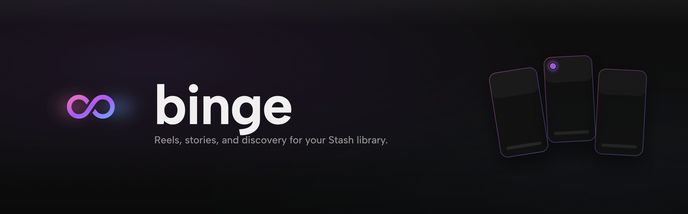
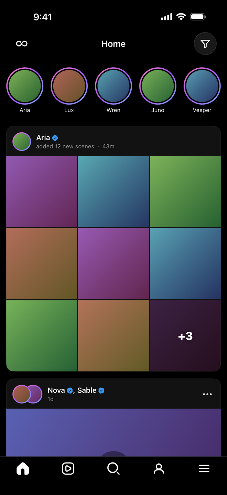
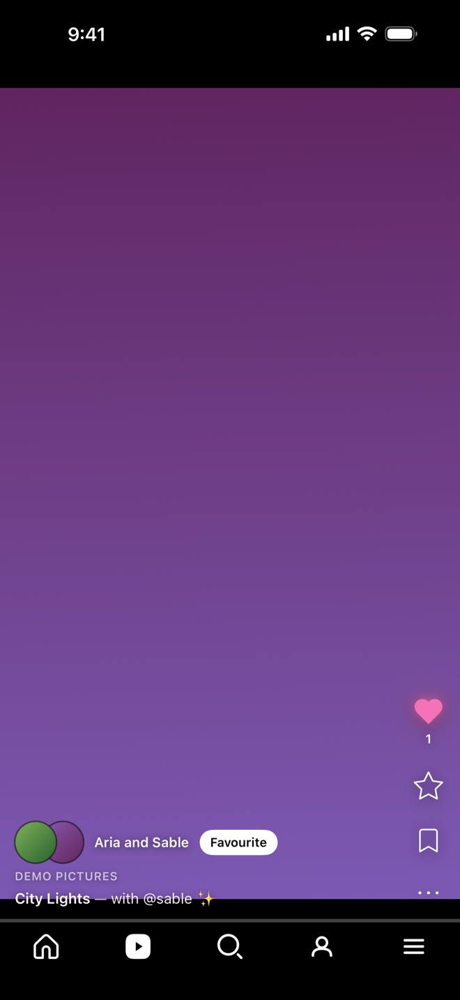
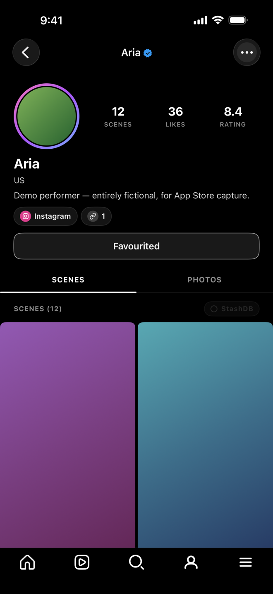
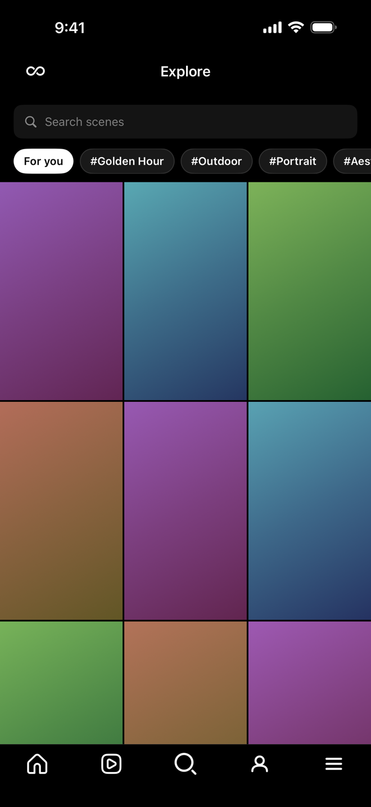
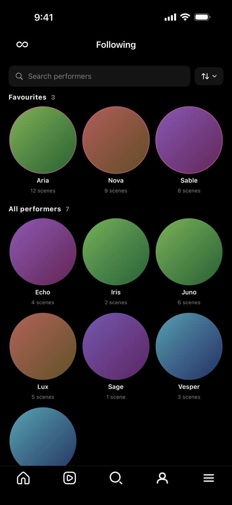
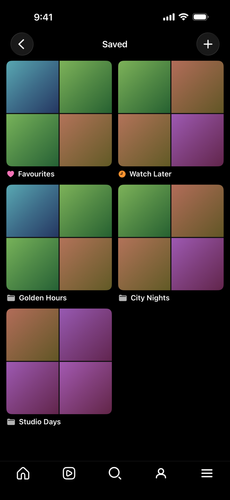
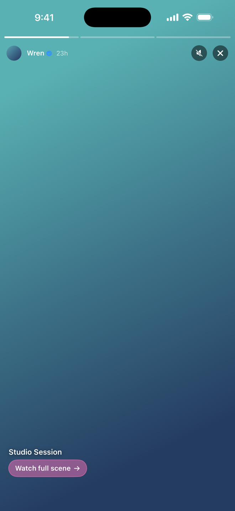

<p align="center"></p>

Native iOS client for [Stash](https://github.com/stashapp/stash). Sister project of the [binge web plugin](https://github.com/ordureconnoisseur/binge), feature-matched and reading from the same Stash GraphQL API. SwiftUI + AVKit, iOS 17+.

---

## Highlights

- **Vertical reel** — paged swipe, double-tap-to-like, hold-to-pause, action stack (heart, rate, scribe, save, ⋯).
- **Home** — IG-style stories row (library + StashDB + optional Reddit) over a scene feed. Bulk imports collapse into single pack cards.
- **Explore + Following + Saved** — search, Discover Performers row, favourited list, collections (3-column grid each).
- **Performer profiles** — bio, social links, stats, scene grid. Library and StashDB-only variants share the layout.
- **StashDB discovery** — DISCOVER + TRENDING cards in Home; one-tap Follow + Add scene to library.
- **Native swipe-back** everywhere — interactive pop gesture from the left edge, slide-from-right push transitions.

---

## Screenshots

> Example captures — fictional names and placeholder visuals, not real library content.

<p align="center">
  
  
  
</p>
<p align="center">
  
  
  
  
</p>

<!-- A reel-in-motion hero clip will replace the static reel shot once captured. -->

---

## Install

You need a Stash server. The app talks to its GraphQL API.

```bash
git clone https://github.com/ordureconnoisseur/binge-ios.git
cd binge-ios
brew install xcodegen
xcodegen
open binge.xcodeproj
```

In Xcode: **Signing → your Apple ID**, plug in your iPhone, ⌘R.

A free Apple ID works for personal sideload (7-day expiry, your own devices). A paid Developer account unlocks TestFlight + longer install windows.

### First launch

Paste your Stash URL, then either:

- **API key** — Stash → Settings → Security → API Key, paste it.
- **Sign in** — username + password; binge fetches your API key automatically (no key rotation).

Credentials are stored in the iOS Keychain.

---

## Companion plugin integrations

Detected at runtime — install whichever you want; binge degrades gracefully when they're absent.

| Plugin | What it adds |
|-|-|
| [stash-advanced-rating](https://github.com/ordureconnoisseur/stash-advanced-rating) | Per-criterion 0–5 rating modal in reel + performer profile |
| [stash-scribe](https://github.com/ordureconnoisseur/stash-scribe) | Scribe pencil icon → LLM-powered review writing |
| [binge-server](https://github.com/ordureconnoisseur/binge-server) | Reddit posts in the stories row |

---

## Library prep (optional)

AVPlayer struggles with some codecs over remote Stash connections. Two helper scripts handle the common issues:

- **`scripts/convert-vp9.sh <path>`** — re-encodes VP9 to H.264 in place (atomic tmp + rename, libx264 veryfast / CRF 23). For Instagram-shaped libraries.
- **`scripts/fix-hevc-tag.sh <path>`** — rewrites HEVC `hev1` codec tag to `hvc1` + `+faststart`. No re-encoding, seconds per file. Resolves most AVPlayer-HEVC autoplay quirks.

Both walk the tree, ffprobe each file, only touch what matches.

---

## Settings

**Menu → Settings.** All preferences stored locally.

| Setting | Default | Notes |
|-|-|-|
| Stash connection | — | URL + API key (or sign-in) |
| Genders to surface | All | Drives Discover row + stories |
| Stream type | Auto | Auto / Direct / MP4 / HLS / WebM |
| Recent window | 30 days | How far back "new" means for stories + feed |
| Include StashDB new releases | On | In stories + Home |
| Mix StashDB into profiles | Off | Also flip-able per-profile from the scenes-heading pill |
| Include Reddit posts | On | Requires binge-server reachable |
| binge-server URL | `http://localhost:7878` | Override if remote |
| Auto-scroll | Off | Advance to next scene when current ends |

---

## Architecture

- **SwiftUI + AVKit + AVFoundation**, iOS 17+ for `.scrollPosition(id:)` paging and the Observation framework.
- **`StashClient.gql<T>`** — single async-throws GraphQL function, mirrors the web's `graphql.ts`.
- **`PlayerPool`** — capacity-3 LRU of `AVQueuePlayer` + `AVPlayerLooper`. N+1 prewarm. Buffer tuned for first-frame speed over Tailscale-style links.
- **`KeychainStore`** — `@Observable` singleton wrapping Security framework. Auto-migrates from UserDefaults on first launch.
- **NavigationStack push** for every drilled-in destination — reels, performer profiles, collection grids. Native edge-swipe pop everywhere.
- **No build-time plugin coupling** — `PluginContext` queries Stash's `plugins { id enabled }` at boot; features gate via SwiftUI environment.

---

## Development

```bash
xcodegen   # regen project after adding files or editing project.yml
xcodebuild -scheme binge -destination 'generic/platform=iOS' \
    CODE_SIGNING_ALLOWED=NO build   # CI-style compile check
```

Project file (`binge.xcodeproj`) is checked in but regenerated by XcodeGen — run `xcodegen` after adding source files.

---

## License

AGPL-3.0. See [LICENSE](./LICENSE). (Matches Stash's own license.)
